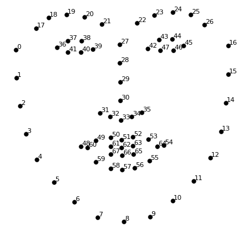
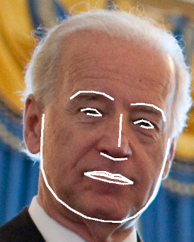
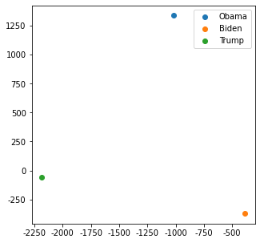

# Face Recognition

This project mainly has 4 sections to do face recognition:

* Section1: Face Feature Extraction
* Section2: Image Face Detection
* Section3: Web Camera Face Detection
* Section4: Video Face Detection

### Section1：Face Feature Extraction

This part shows the basic face recognition principles, including facial features and Facial embedding.

> **Facial features:** 

Basic ides in facial recognition in normal face is come up with 68 specific points(landmarks), including the chin, left eyebrow, right eyebrow, nose bridge, nose tip, left eye, right eye, top lip and bottom lip.

<div align=center></div>

We use bidden face as example to finish this job. This face will look like the following picture after face feature extract.

<div align=center></div>

> **Facial Embedding:** 

In this part, each person's face information will store as a *vector*.

- Compare two face distance
  - faces with a distance of **0.6 or less** should be a match.
  - using a **0.55 cutoff** (if want to be more strict; cutoff would reduce false positive matches at the risk of more false negatives)

For example, we calculate the distance between Biden, Trump and Obama(by using *TSNE*):

<div align=center></div>

### Section2: Image Face Detection

This is a section by using KNN and SVM classifier to do face recognition.

* KNN model:
  * KNN classifier is first trained on a set of labeled (known) faces and can then predict the person in an unknown image by finding the k most similar faces (images with closet face-features under euclidean distance) in its training set, and performing a majority vote (possibly weighted) on their label. This implementation uses a weighted vote, such that the votes of closer-neighbors are weighted more heavily. This implementation uses a weighted vote, such that the votes of closer-neighbors are weighted more heavily.
  * Example: if k=3, and the five closest face images to the given image in the training set are three image of Biden and two images of Obama, The result would be 'Biden'.
  * How to use:
    * Organize the set of images of the people you want to recognize in a single directory with a sub-directory for each known person.
    * Then, call the 'train' function with the appropriate parameters. Make sure to pass in the 'model_save_path' if you want to save the model to disk so you can re-use the model without having to re-train it.
    * Call 'predict' and pass in your trained model to recognize the people in an unknown image.

```
Directory structure:
1. train_dir/Biden/xxx.jpg ...
2. train_dir/Barack Obama/yyy.jpg ...
3. train_dir/Donald Trump/zzz.jpg ...
```

> **3D PCA**

Put Obama, Biden, Trump, Gates, Zuckerberg and Pages' images visualized by 3D PCA 

<div align=center></div>

> Face detection

<div align=center></div>

This is a example for recognize Obama's face.


